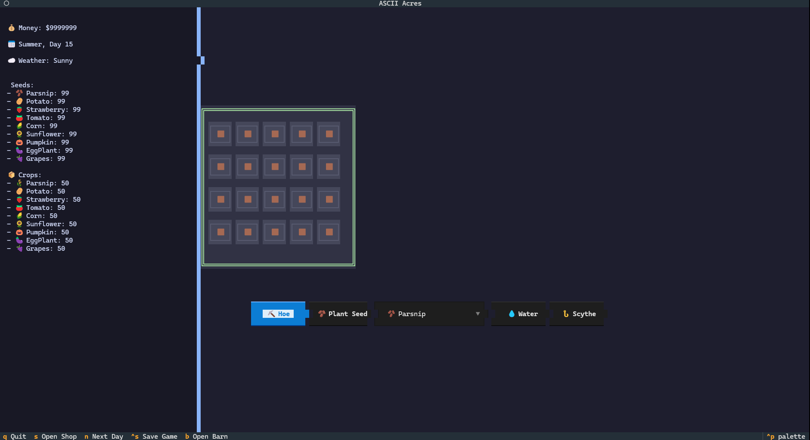

# ASCII Acres 🌾

**ASCII Acres** is a terminal based farming game where u buy crop plant them and farm them and aura farm them, u also handle ur animols and upgrade ur tool and all that stuff

## Why I Made This
made this cause i was bored and needed fpv drone parts
i was very amazed seeing cli games so i wanted to make one for myself

## How to Use It
1. Clone this repository and navigate into the folder.
2. Install the required dependency (Textual):
   ```bash
   pip install -r requirements.txt
   ```
3. Run the game:
   ```bash
   python main.py
   ```
4. **Controls**:
   - `s` - Open the Shop to buy seeds, animals, and tool upgrades.
   - `b` - Open the Barn to feed animals and collect milk/eggs.
   - `n` - Sleep and move to the next day.
   - `ctrl+s` - Save your game.
   - `q` - Quit.

## Visuals


## AI Usage
ai was mostly used in the ui and all that stuff in the game